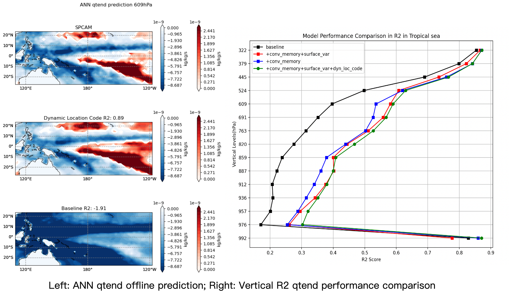

# NNCAM_Training

## Training (training_scripts)

### Setup

* Edit `configs.py`:
    * `CKPT_DIR`: directory to save model checkpoints (need to be created manually)
    * `DATA_DIR`: directory containing `*.npy` files and `col_names.txt`
    * `SAMPLE_RATE`: 12 (6 hours)/1 (30 minutes)
    * `BASELINE_CKPT_PREFIX`: prefix of output checkpoint directory for baseline training
    * `VAE_CKPT_PREFIX`: prefix of output checkpoint directory for vae training

### Baseline training

* Usage
```
usage: scripts_train_time_model029_ex.py [-h] [--multistep MULTISTEP]
                                         [--lr LR] [--region_mask REGION_MASK]
                                         [--data_means DATA_MEANS]
                                         [--data_stds DATA_STDS]
                                         [--ex_input_prev [EX_INPUT_PREV]]
                                         [--ex_input [EX_INPUT]]
                                         [--resume RESUME]

optional arguments:
  -h, --help            show this help message and exit
  --multistep MULTISTEP
                        number of previous timesteps to be used as inputs
  --lr LR               learning rate (default to 0.001)
  --region_mask REGION_MASK
                        default to all 96x144 grid, otherwirse path to a
                        region mask (in ../consts folder)
  --data_means DATA_MEANS
                        path to npz files that stores means for all variables
                        (in ../consts folder), default to
                        ../consts/all_means.npz
  --data_stds DATA_STDS
                        path to npz files that stores stds for all variables
                        (in ../consts folder), default to
                        ../consts/all_stds.npz
  --ex_input_prev [EX_INPUT_PREV]
                        input variables to be added for previous timesteps (in
                        addition to Q,T,dTls,dqls,solin,ps,qtend,stend,SOLL,SO
                        LLD,SOLS,SOLSD,FSDS
  --ex_input [EX_INPUT]
                        input variables to be added for previous timesteps (in
                        addition to Q,T,dTls,dqls,solin,ps
  --resume RESUME       resume from saved checkpoints training
```

* Examples
    * Default training setting for 96x144 grids
        | | Input variables|
        |:-------------------------------------:|:-------------------------------------:|
        | Current timestep | Q,T,dqls,dTls,solin,ps                |
        |Previous timestep | Q,T,dqls,dTls,solin,ps,qtend,stend,SOLL,SOLLD,SOLS,SOLSD,FSDS|
    ```
    python scripts_train_time_model029_ex.py
    ```
    * Training with full variables in sea region only 
        | | Input variables|
        |:-------------------------------------:|:-------------------------------------:|
        | Current timestep | Q,T,dqls,dTls,solin,ps,LWUP,CAPE,U,V|
        |Previous timestep | Q,T,dqls,dTls,solin,ps,LWUP,CAPE,U,V,qtend,stend,SOLL,SOLLD,SOLS,SOLSD,FSDS,CLOUD,SPPRECC,FLNS,FLNT,SPQRL,SPQRS|
    ```
    python scripts_train_time_model029_ex.py 
        --region_mask ../consts/seamask.npy 
        --data_means ../consts/seamask_means.npz 
        --data_stds ../consts/seamask_stds.npz
        --ex_input LWUP+CAPE+U+V
        --ex_input_prev CLOUD+SPPRECC+FLNS+FLNT+SPQRL+SPQRS
    ```

### Baseline Offline Evaluation

* Usage
```
usage: offline_test_newformat.py [-h] [--sample_rate SAMPLE_RATE] [--thick]
                                 [--region_mask REGION_MASK]
                                 [--start_ts START_TS] [--multistep MULTISTEP]
                                 [--ex_input [EX_INPUT [EX_INPUT ...]]]
                                 [--ex_input_prev [EX_INPUT_PREV [EX_INPUT_PREV ...]]]
                                 [--data_means DATA_MEANS]
                                 [--data_stds DATA_STDS]
                                 resume out_json

positional arguments:
  resume                path to configuration file
  out_json              path to output json file

optional arguments:
  -h, --help            show this help message and exit
  --sample_rate SAMPLE_RATE sample rate for offline test to be performed
                        sample frequency to use
  --thick               whether to test with thickness computation
  --region_mask REGION_MASK
  --start_ts START_TS   indicate the start timestep to perform the offline test, default to 35040, which uses all available timesteps in testing data (starts from 35040)
  --multistep MULTISTEP number of multistep to be used as input (this should match the checkpoint being loaded)
  --ex_input [EX_INPUT [EX_INPUT ...]] should match checkpoint config
  --ex_input_prev [EX_INPUT_PREV [EX_INPUT_PREV ...]] should match checkpoint config
  --data_means DATA_MEANS should match checkpoint config
  --data_stds DATA_STDS   should match checkpoint config

outputs:
  out_json: file that stores overall metrics
  ex_qtend_{out_json}_vert.npz: file that stores vertical metrics (along pressure levels)
  ex_qtend_{out_json}_spatial.npz: file that stores spatial metrics (metrics for each grid point 96x144)
```

* Examples
Offline test baseline model performance in twp region
```
python offline_test_newformat.py /share3/chenj209/ckpts_time/baseline_model_sampled12_multistep0_lr0.001_region_twp_region/checkpoint_epoch20.pth.tar baseline_twp_ts0.json --region_mask ../consts/twp_region.npy --data_means ../consts/twp_region_means.npz --data_stds ../consts/twp_region_stds.npz --multistep 0 
```
### VAE training 
* Usage
```
usage: scripts_train_ae_combined.py [-h] [--multistep MULTISTEP] [--lr LR] [--region_mask REGION_MASK] [--data_means DATA_MEANS] [--data_stds DATA_STDS]
                                    [--ex_input_prev [EX_INPUT_PREV]] [--ex_input [EX_INPUT]] [--rec_weight REC_WEIGHT] [--pred_weight PRED_WEIGHT]
                                    [--ae_config AE_CONFIG] [--resume [RESUME]]

optional arguments:
  -h, --help            show this help message and exit
  --multistep MULTISTEP
                        number of previous timesteps to be used as inputs
  --lr LR               learning rate (default to 0.001)
  --region_mask REGION_MASK
                        default to all 96x144 grid, otherwirse path to a region mask (in ../consts folder)
  --data_means DATA_MEANS
                        path to npz files that stores means for all variables (in ../consts folder), default to ../consts/all_means.npz
  --data_stds DATA_STDS
                        path to npz files that stores stds for all variables (in ../consts folder), default to ../consts/all_stds.npz
  --rec_weight REC_WEIGHT
                        weight for reconstruction loss
  --pred_weight PRED_WEIGHT
                        weight for prediction loss
  --ae_config AE_CONFIG
                        path to json file that stores the autoencoder configuration
  --resume [RESUME]     path to checkpoint to resume training
  ```
  * Sample `ae_config` file
```
{
"resmlp_input_size": [0, 96, 144],
"variational": true,
"latent_size": 8,
"sample_rate": 12,
"ae_lr": 0.0001,
"resmlp_lr": 0.001,
"ae_warmup_epochs": 200,
"beta": 0.002,
"ltype": "mse",
"reduce_lvl": false,
"resmlp_target": ["qtend_check"],
"x_ae": [
    "QL_lev",
    "T_nn_in_lev",
    "dqvls_nn_in_lev",
    "dTls_nn_in_lev",
    "SOLIN",
    "SPPS",
    "LWUP",
    "CAPE",
    "UL_lev",
    "VL_lev"
],
"x_ae_prev": [
    "qtend_check_lev",
    "stend_check_lev",
    "SOLL",
    "SOLLD",
    "SOLS",
    "SOLSD",
    "FSDS",
    "CLOUD_lev",
    "SPPRECC",
    "FLNS",
    "FLNT",
    "SPQRL_lev",
    "SPQRS_lev"
],
"x_resmlp": [
    "QL_lev",
    "T_nn_in_lev",
    "dqvls_nn_in_lev",
    "dTls_nn_in_lev",
    "SOLIN",
    "SPPS",
    "LWUP",
    "CAPE",
    "UL_lev",
    "VL_lev"
],
"x_resmlp_prev": [
    "qtend_check_lev",
    "stend_check_lev",
    "SOLL",
    "SOLLD",
    "SOLS",
    "SOLSD",
    "FSDS",
    "CLOUD_lev",
    "SPPRECC",
    "FLNS",
    "FLNT",
    "SPQRL_lev",
    "SPQRS_lev"
],
"encoder": {
    "variational": true,
    "input_size": [
        0,
        96,
        144
    ],
    "channel_sizes": [
        512,
        256,
        128,
        64,
        32,
        8
    ],
    "kernel_size": 3,
    "stride": [
        1,
        1,
        1,
        1,
        1,
        1
    ],
    "conv_padding": [
        1,
        1,
        1,
        1,
        1,
        1
    ],
    "output_padding": [
        0,
        0,
        0,
        0,
        0,
        0
    ],
    "fc_sizes": [],
    "num_em_layers": 2
}
,
"decoder": {
    "variational": true,
    "input_size": [
        0,
        96,
        144
    ],
    "channel_sizes": [
        8,
        32,
        64,
        128,
        256,
        512
    ],
    "kernel_size": 3,
    "stride": [
        1,
        1,
        1,
        1,
        1,
        1
    ],
    "conv_padding": [
        1,
        1,
        1,
        1,
        1,
        1
    ],
    "deconv_padding": [
        1,
        1,
        1,
        1,
        1,
        1
    ],
    "output_padding": [
        0,
        0,
        0,
        0,
        0,
        0
    ],
    "fc_sizes": [],
    "num_em_layers": 2
}
}
```
* Examples
    * Pretrain VAE for sea region
    ```
    python scripts_train_ae_combined.py --region_mask ../consts/seamask.npy --data_means ../consts/seamask_means.npz --data_stds ../consts/seamask_stds.npz --rec_weight 1.0 --pred_weight 0.0 --ae_config sample_ae_config.json
    ```
    * Finetune VAE and resmlp for sea region
    ```
    python scripts_train_ae_combined.py --region_mask ../consts/seamask.npy --data_means ../consts/seamask_means.npz --data_stds ../consts/seamask_stds.npz --rec_weight 0.0 --pred_weight 1.0 --ae_config sample_ae_config.json --resume pretrain_sea_vae.pth.tar
    ```

### VAE offline test

* Usage
```
usage: offline_test_ae_paired.py [-h] [--ae_config AE_CONFIG] [--multistep MULTISTEP] [--resume RESUME] [--save_path SAVE_PATH]
                                 [--sample_rate SAMPLE_RATE] [--region_mask REGION_MASK] [--data_means DATA_MEANS] [--data_stds DATA_STDS] [--thick]
                                 [--resmlp_only] [--non_parallel NON_PARALLEL]

offline test for autoencoder

optional arguments:
  -h, --help            show this help message and exit
  --ae_config AE_CONFIG
                        path to ae config file
  --multistep MULTISTEP
                        multistep
  --resume RESUME       path to ae model file
  --save_path SAVE_PATH
                        path to save results
  --sample_rate SAMPLE_RATE
                        sample_rate
  --region_mask REGION_MASK
                        path to region mask npy file
  --data_means DATA_MEANS
                        path to region mask npy file
  --data_stds DATA_STDS
                        path to region mask npy file
  --thick               use thick mask
  --resmlp_only         use resmlp only
  --non_parallel NON_PARALLEL
```
* Examples
    * Offline test sea region finetuned VAE
    ```
    python offline_test_ae_paired.py --ae_config sample_ae_config.json --resume sea_finetuned_vae.pth.tar --data_means ../cosnts/seamask_means.npz --data_stds ../consts/seamask_stds.npz --resmlp_only
    ```

### Results
* All model performance
    
